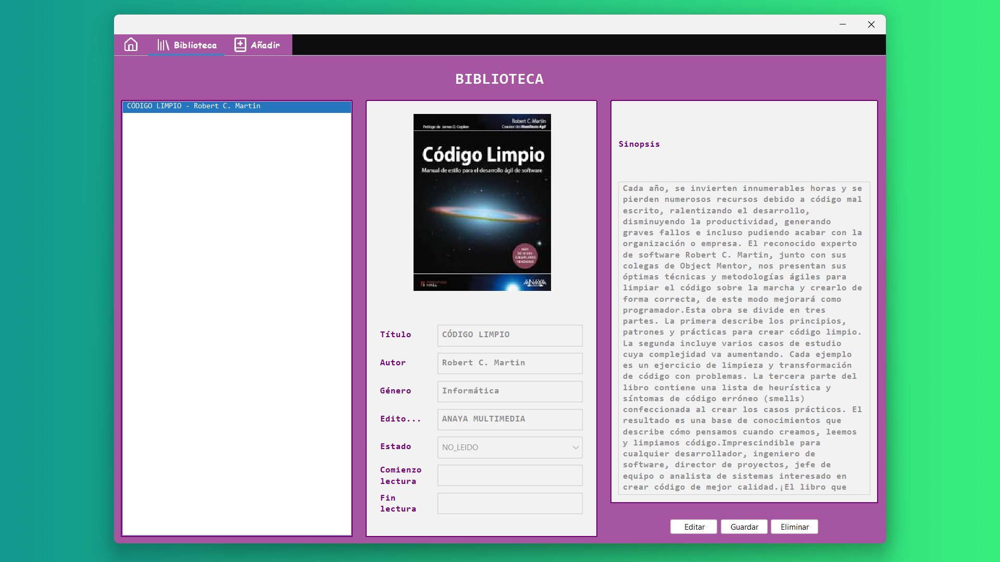
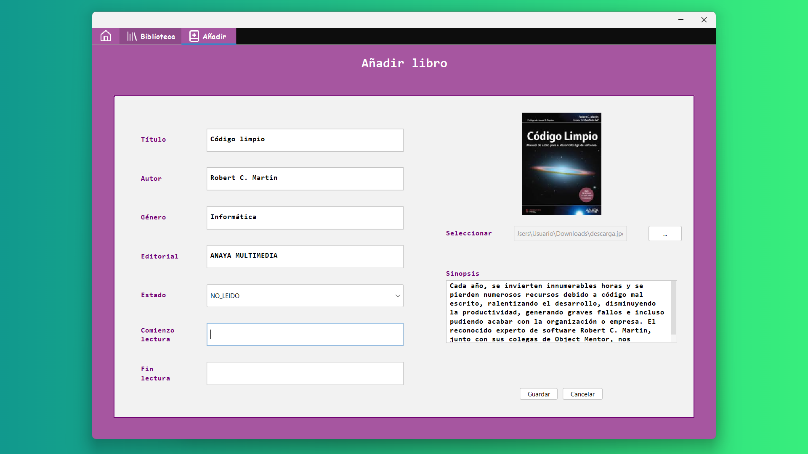
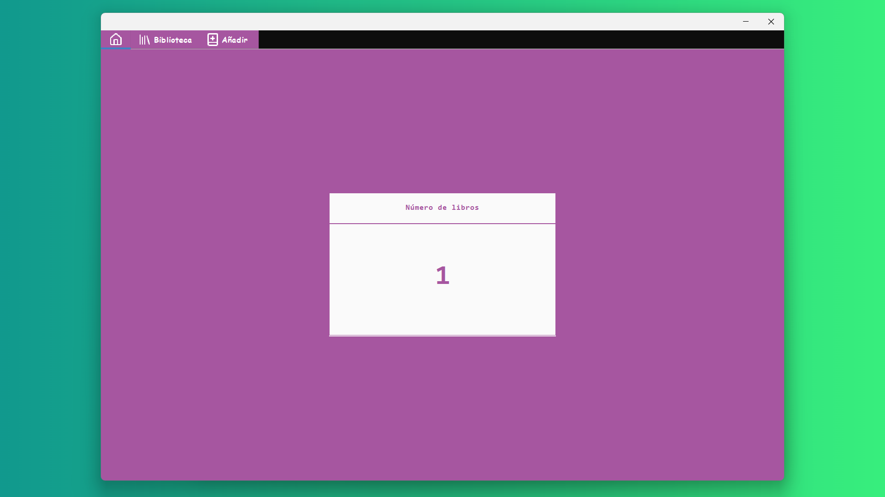

# ID_ejercicio_evaluable_5

Ejercicio evaluable 2ºDAM Desarrollo de interfaces</a>

  Ejercicio_Evaluable_5: documentación, pruebas y distribución de aplicaciones.
  Nota: 10
  Profesor: Daniel Pérez Montañez

=======
## Imágenes

  

  

  

=======

## Herramientas

- Lucide-Icons

## 📃 License

Este proyecto está bajo la [MIT License](LICENSE.md).
